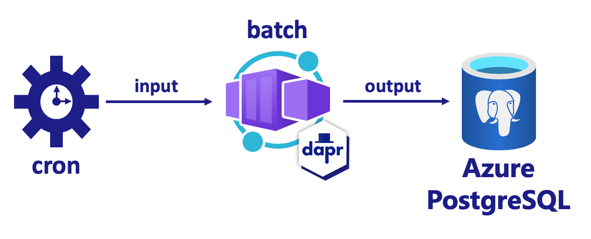

# Event-driven work using bindings

https://learn.microsoft.com/en-us/azure/container-apps/microservices-dapr-bindings?source=recommendations&pivots=csharp

In this quickstart, you'll create a microservice to demonstrate Dapr's bindings API to work with external systems as inputs and outputs. The service listens to input binding events from a system CRON and then outputs the contents of local data to a PostreSql output binding. 



Visit [this](https://docs.dapr.io/developing-applications/building-blocks/bindings/) link for more information about Dapr and Bindings.

# Run and develop locally

### DAPR

1. Init dapr: init (or uninstall first)

### Run and initialize PostgreSQL container

1. Open a new terminal, change directories to `../../db`, and run the container with [Docker Compose](https://docs.docker.com/compose/): 

<!-- STEP
name: Run and initialize PostgreSQL container
expected_return_code:
background: true
sleep: 5
timeout_seconds: 6
-->

```bash
cd db/
docker compose up -d
```

<!-- END_STEP -->

### Run .NET service with Dapr

2. Open a new terminal window, change directories to `./batch` in the quickstart directory and run: 

<!-- STEP
name: Install .NET dependencies
-->

```bash
cd ./batch
dotnet restore
dotnet build
```

<!-- END_STEP -->
3. Run the .NET service app with Dapr: 

<!-- STEP
name: Run batch-sdk service
working_dir: ./batch
expected_stdout_lines:
  - '== APP == insert into orders (orderid, customer, price) values (1, ''John Smith'', 100.32)'
  - '== APP == insert into orders (orderid, customer, price) values (2, ''Jane Bond'', 15.4)'
  - '== APP == insert into orders (orderid, customer, price) values (3, ''Tony James'', 35.56)'
  - '== APP == Finished processing batch'
expected_stderr_lines:
output_match_mode: substring
sleep: 11
timeout_seconds: 30
-->
    
```bash
dapr run --app-id batch-sdk --app-port 7002 --components-path ../components -- dotnet run
```
<!-- END_STEP -->

4. Expected output:
A batch script runs every 10 seconds using an input Cron binding. The script processes a JSON file and outputs data to a SQL database using the PostgreSQL Dapr binding:

```bash
== APP == {"sql": "insert into orders (orderid, customer, price) values (1, 'John Smith', 100.32);"}
== APP == {"sql": "insert into orders (orderid, customer, price) values (2, 'Jane Bond', 15.4);"}
== APP == {"sql": "insert into orders (orderid, customer, price) values (3, 'Tony James', 35.56);"}
== APP == Finished processing batch
== APP == {"sql": "insert into orders (orderid, customer, price) values (1, 'John Smith', 100.32);"}
== APP == {"sql": "insert into orders (orderid, customer, price) values (2, 'Jane Bond', 15.4);"}
== APP == {"sql": "insert into orders (orderid, customer, price) values (3, 'Tony James', 35.56);"}
== APP == Finished processing batch
== APP == {"sql": "insert into orders (orderid, customer, price) values (1, 'John Smith', 100.32);"}
== APP == {"sql": "insert into orders (orderid, customer, price) values (2, 'Jane Bond', 15.4);"}
== APP == {"sql": "insert into orders (orderid, customer, price) values (3, 'Tony James', 35.56);"}
== APP == Finished processing batch
```

5. Stop postgres container 

```bash
cd ../db
docker compose stop
```

# Deploy to Azure (Azure Container Apps and Azure Postgres)
Deploy to Azure for dev-test

NOTE: make sure you have Azure Dev CLI pre-reqs [here](https://learn.microsoft.com/en-us/azure/developer/azure-developer-cli/install-azd?tabs=winget-windows%2Cbrew-mac%2Cscript-linux&pivots=os-windows) and are on version 0.9.0-beta.3 or greater.

1. Run the following command to initialize the project. 

```bash
azd init --template https://github.com/Azure-Samples/bindings-dapr-csharp-cron-postgres
``` 

This command will clone the code to your current folder and prompt you for the following information:

- `Environment Name`: This will be used as a prefix for the resource group that will be created to hold all Azure resources. This name should be unique within your Azure subscription.

2. Run the following command to package a deployable copy of your application, provision the template's infrastructure to Azure and also deploy the application code to those newly provisioned resources.

```bash
azd up
```

This command will prompt you for the following information:
- `Azure Location`: The Azure location where your resources will be deployed.
- `Azure Subscription`: The Azure Subscription where your resources will be deployed.

> NOTE: This may take a while to complete as it executes three commands: `azd package` (packages a deployable copy of your application),`azd provision` (provisions Azure resources), and `azd deploy` (deploys application code). You will see a progress indicator as it packages, provisions and deploys your application.

3. Confirm the deployment is susccessful:

Navigate to the Container App resource for the Batch service. Locate the `Log stream` and confirm the batch container is logging each insert successfully every 10s. 


